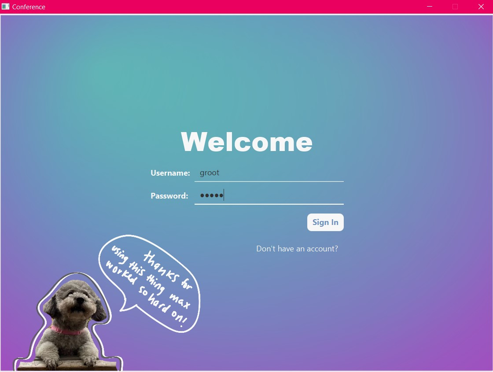
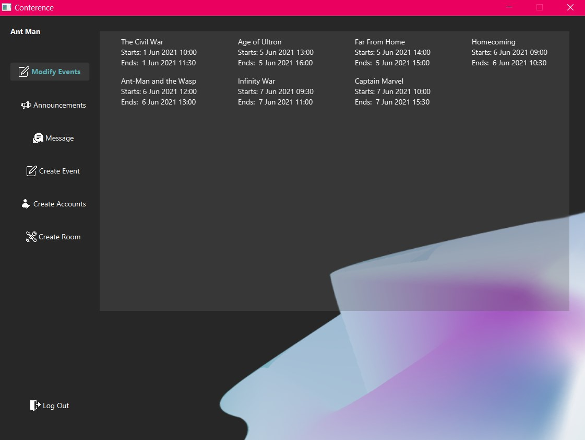
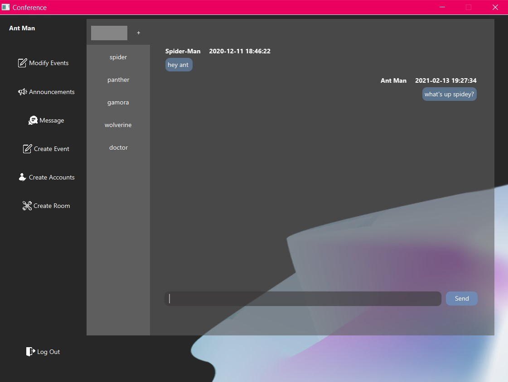

# Tech-Conference (Ticketing Platform)

## University Project - CSC207 - Software Design

##### The purpose of the project is to demostrate the understanding and implementation of:

- The **SOLID principles** of Object Oriented Design
- **Clean Architechture**
- **Design Patterns**
- Using **CRC cards** to start a project
- Regex
- Javadocs
- UML diagrams

The design patterns covered in depth are:
- Dependency Injection 
- Iterator
- Observer
- Strategy
- Factory Method 
- Abstract Factory 
- Adapter
- Builder
- Façade

> The design pattern implementation has been described in ```DesignPatterns.txt```.


## Demo




### Welcome

To start this program, run ```src/GUIApplication.java```.

Here are some pre-made attendees, organizers, speakers, and rooms that you can try out! Feel free to also make your own.
The format of the following user accounts below is Name: Username, Password

Attendees:
	
	Dead pool: dead, pool
	Groot: groot, groot
	Captain America: captain, america
	Hulk: hulk, smash
	She-Hulk: she_hulk, she-smash
	Spider-Man: spider, man

Organizers:
	
	Thor: thor, hammer
	Ant Man: ant, man
	Black Widow: black, widow
	Iron Man: iron, man

Speakers:
	
	Wolverine: wolverine, zing-zing
	Gamora: gamora, dead
	Doctor Strange: doctor, strange
	Black Panther: panther, black

Admins:
	
	Stan: stan, lee
	Thanos: thanos, snap


There are also a bunch of pre-made events. All the users have randomly been enrolled, are organizing, or are
speaking at some event for testing purposes.

Some event pairs that have overlapping times:
	
	- Age of Ultron, Far from Home
	- Infinity War, Captain Marvel

Here is a list of pre-made rooms with their corresponding maximum capacity:
	
	- New York City: 15
	- Avengers Mansion: 11
	- Stark Tower: 11
	- Wakanda: 7
	- Asgard (No events scheduled in this room yet): 4

For full details, you can check out the JSON files under the package named "Data". Enjoy!

### Specification (given by course instructor)

A program that allows people at a conference (examples: a tech conference, a TED-style conference, an employment fair, etc.) to communicate with each other in specific ways. 

#### Users

Organizers of the conference should be able to enter rooms into the system and create speaker accounts. They should also be able to schedule the speakers to each speak in one or more rooms at different times so that at most one speaker speaks in each room at any given time and each room has at most one speaker at any given time. You can assume that all talks are 1 hour long and happen between 9 am and 5 pm. The Organizer will have the ability to cancel or reschedule an event before it happens. You may want to consider this when you create your initial design.

Speakers at the conference should be able to log in and see a list of talks that they are giving. They should also be able to message all Attendees who are signed up for a particular event, at once or individually.

Attendees should be able to log in and see a schedule of events for which they can sign up. They should be able to sign up for events, cancel their enrolment in an event, see the schedule of the events for which they signed up, send messages to and receive messages from other Attendees, and message with Speakers.

#### Login System

Every user should be able to log into the system and interact with a menu of options that are specific to their type of user.

#### Schedule System

It should be possible for an Organizer to schedule each speaker to give a talk at specific times in specific rooms, without double-booking a speaker (scheduling them to speak two places at the same time) or double-booking a room (scheduling two people to speak in the same room at the same time). This can be done automatically by your system, by giving the user enough information to avoid such conflicts, or restricting the choices an Organizer can make.

#### Sign-Up System

Attendees will be able to browse the talks and decide which ones they want to see. They will also be able to sign up for the talk. You can assume that each room has a capacity of 2 people besides the speaker. For Phase 2, this will change. But for now, it makes it easier to test your program. Attendees should not be able to sign up for an event that is already full.

#### Messaging System

Speakers should be able to send a message that automatically goes to all Attendees of their talk or multiple talks that they gave.

Organizers should be able to send a message to all speakers, one specific speaker, all Attendees, or one specific Attendee.

Attendees should be able to message other Attendees or Speakers. Speakers should be able to respond to a specific Attendee.

#### Saving and Persistence of Information

When your program finishes running, information inside the program will be deleted. If you want to be able to use that information the next time you run your program, you will have to store that info outside of your program and have your program read it back in. Good ways to do this are by storing information in a ```.txt``` file, a ```.csv``` file, or a ```.ser``` file.


### Added extensions (Not mandatory)

- Implementing a **GUI with JavaFx**. (GUI was not taught in the course)

- JSON files containing details about users, messages, rooms, and events.

- There will now be many types of events. A one-speaker event is the same as a "talk" from Phase 1. You can have multi-speaker events, like a panel discussion, and no-speaker events, like a party. Events can last as long as you want. You can measure the duration of an event in hours, or minutes. You get to decide.

- Events can be canceled by at least one organizer.

- At least one more type of user will be included in your program. For example, an Admin user who can delete messages or events with no attendees, or a VIP user who can access VIP-only events.

- Organizers can also create Speaker accounts, Attendee accounts, and any other type of user accounts that are in your program.

- Each event has a maximum number of people who can attend it. This amount can be set when the event is created and also changed later, by an organizer. Your program should check the maximum capacity for the room where the event will be held, and prevent the number of attendees from going above the room's capacity.

- All users can directly message any user if they know their username, conversation is initiated by entering the username in the input field and clicking the "+" sign next to it. Past messages can be accessed by clicking on the existing conversation.

- Sign up as attendee or organizer by clicking on "Don't have an account?" on the welcome screen, if the user doesn't have an account.

- Clicking on the word "Speakers" in the event information section, the user is able to see the full list of speakers in a pop-up window.

- Added Admins. An ```admin``` can delete events with no attendees by selecting it on the "Delete Events" page and can also delete the chat history between any two users under the "Delete Chats" section.

> Other feature updates are mentioned in ```FeaturesList.txt```.

> The text-based implementation has been deleted.
